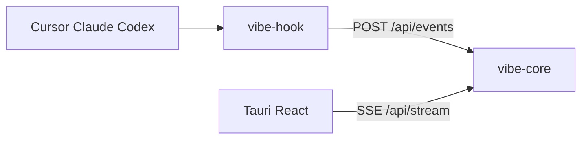

# Vibe Monitor

[](https://github.com/vibe-monitor/vibe-monitor/actions/workflows/ci.yml)


跨平台桌面 **HUD 浮窗 / 系统托盘** 工具，监听 **Cursor**、**Claude Code**、**OpenAI Codex** 是否处于 Agent 式 vibe coding，并在浮窗或托盘上显示当前任务摘要。所有通信仅在 `127.0.0.1` 本机完成，**不上传云端**。

## 功能特性

- **首次运行向导**：点击「启用监听」后，自动安装 `vibe-hook` 并合并三端 hook 配置（带 `vibe-monitor` 标记，可安全重复执行）。
- **可选轻量模式**：监视 `~/.cursor/projects/**/agent-transcripts/**/*.jsonl` 与 `~/.claude/projects/**/*.jsonl`；在 hook 未触发时仍能感知活动（macOS 默认开启，其他平台默认关闭）。
- **实时 HUD**：通过 SSE（`/api/stream`）刷新相位与来源；多个进行中的会话时，展示**最近活跃**的来源。
- **macOS 展示模式**：置顶透明浮窗（`float`，默认）或仅托盘（`menubar`）；托盘菜单可切换模式、运行诊断、重新安装 hook。
- **本地 HTTP API**：嵌入于桌面进程的 `vibe-core`（Axum），默认端口 **17392**；若被占用则依次尝试最多 5 个连续端口，当前端口写入数据目录下的 `port` 文件。

## 支持矩阵

| 能力 | macOS | Windows | Linux（本地构建） |
|------|-------|---------|-------------------|
| 置顶浮窗 / 托盘 | 浮窗 + 托盘 | 托盘 + 可选浮窗 | 未在 CI 验证 |
| Cursor hooks | 是 | 是（`vibe-hook.cmd`） | 理论支持 |
| Claude Code hooks | 是 | 是 | 理论支持 |
| Codex hooks | 是（需 `codex_hooks`） | 可能受限 | 理论支持 |
| 轻量 transcript 模式 | 是（默认开） | 是（默认关） | 是 |

官方 **CI 构建与发布** 目标平台为 **macOS、Windows**（见 [`.github/workflows/ci.yml`](.github/workflows/ci.yml)）。Linux 可自行 `tauri build`，行为未经 CI 保证。

## 开箱即用

1. 从 [GitHub Releases](https://github.com/vibe-monitor/vibe-monitor/releases) 安装对应平台安装包；推送 `v*` 标签会触发构建，详见 [docs/release.md](docs/release.md)。v0.1.0 等早期版本可能未做代码签名，亦可按下文从源码构建。
2. 首次启动完成向导，点击 **「启用监听」**（可按需勾选轻量模式）。
3. 在 Cursor / Claude Code / Codex 中开始 Agent 会话；HUD 或托盘图标颜色会随会话相位自动更新。

## 从源码构建

**前置环境**

- [Rust](https://www.rust-lang.org/) stable（见 [rust-toolchain.toml](rust-toolchain.toml)）
- Node **20+**
- npm（CI 使用 `npm ci`）

在**仓库根目录**执行：

```bash
# 必须先构建 hook（向导「启用监听」会安装此二进制）
cargo build -p vibe-hook

# 发布用 core + hook
cargo build -p vibe-hook -p vibe-core --release

# 前端 + 桌面安装包
cd apps/desktop
npm ci
npm run tauri build
```

**开发模式**（同样先在根目录 `cargo build -p vibe-hook`）：

```bash
cd apps/desktop && npm ci && npm run tauri dev
```

**提交前验证**（与 [CONTRIBUTING.md](CONTRIBUTING.md) 一致）：

```bash
cargo test -p vibe-core
cd apps/desktop && npm run build
```

## 工作原理



- 外部 AI 工具通过用户目录下的 hook 配置调用 **`vibe-hook`**，将事件 POST 到 `http://127.0.0.1:<port>/api/events`。
- 桌面 App 内嵌 **`vibe-core`**，维护会话状态并通过 SSE 推送给 React UI。
- 会话按 `source:session_id` 区分；空闲约 **30 秒**无活动后进入 `idle` 相位。

更完整的设计说明见 [docs/architecture.md](docs/architecture.md)。

### 本地 API

| 方法 | 路径 | 说明 |
|------|------|------|
| GET | `/api/status` | 当前快照 |
| GET | `/api/stream` | SSE 推送 |
| POST | `/api/events` | hook 上报 |
| POST | `/api/install-hooks` | 安装/合并 hook |
| GET | `/api/doctor` | 诊断信息 |

## HUD 与相位说明

| 相位 | 含义 |
|------|------|
| `active` | Agent 正在执行 |
| `idle` | 约 30 秒无活动 |
| `waiting_user` | 等待用户输入或确认 |
| `stopped` | 会话已结束 |
| `unknown` | 尚未连接或未收到事件 |

- **macOS** 默认 `float`：透明置顶 HUD，可在所有 Space 显示；应用以 Accessory 模式运行，不出现在 Dock。
- **`menubar` 模式**：隐藏 HUD 浮窗，由托盘图标颜色反映当前相位（可在托盘菜单中切换）。

## 数据目录与隐私

应用数据由 `directories` crate 解析（`ProjectDirs::from("com", "VibeMonitor", "vibe-monitor")`），典型路径如下：

| 平台 | 数据目录 |
|------|----------|
| macOS | `~/Library/Application Support/com.VibeMonitor.vibe-monitor` |
| Linux | `~/.local/share/vibe-monitor` |
| Windows | `%APPDATA%\VibeMonitor\vibe-monitor\data` |

目录内主要文件：

| 文件 / 目录 | 说明 |
|-------------|------|
| `bin/vibe-hook` | 已安装的上报二进制（Windows 另有 `vibe-hook.cmd`） |
| `port` | 当前 HTTP 端口 |
| `state.json` | 轻量模式、默认来源、展示模式等偏好 |
| `first-run.done` | 首次向导完成标记 |

**Hook 写入位置**（安装时合并，带 `metadata.source = "vibe-monitor"`）：

- `~/.cursor/hooks.json`
- `~/.claude/settings.json` → `hooks`
- `~/.codex/hooks.json`（并视情况在 `~/.codex/config.toml` 启用 `[features] codex_hooks = true`）

**隐私**：hook 仅上报截断后的任务标题等活动元数据，**不记录完整 prompt**。状态与端口文件仅保存在上述本机数据目录。

## 故障排查

1. **托盘 → 诊断**：检查 hook 是否已安装、`vibe-hook` 是否在数据目录 `bin/` 下、各来源最近是否收到事件。
2. **重新启用监听**：再次运行首次向导，或调用 `POST /api/install-hooks`（需桌面进程已启动）。
3. **开发环境**：确认已在仓库根目录执行 `cargo build -p vibe-hook`；桌面 App 会从 `target/debug` 或 `target/release` 复制二进制到用户数据目录。
4. **端口**：默认 `17392`；若冲突查看数据目录中的 `port` 文件，或访问 `GET /api/doctor`。
5. **Codex**：确认 `~/.codex/config.toml` 中已启用 `codex_hooks`；Windows 上 Codex hook 能力可能受限。
6. **轻量模式**：hook 正常时可关闭；hook 异常时建议开启以通过 transcript 文件感知活动。

## 项目结构

```
agentCodingMonitor/
├── crates/vibe-core/    # 本地 HTTP、会话状态、hook 安装、轻量文件监视
├── crates/vibe-hook/    # 三端 hook 调用的上报二进制
├── apps/desktop/        # Tauri 2 + React UI
├── hooks/templates/     # hook 配置片段模板（运行时由 install 合并）
└── docs/                # 架构、发布说明、设计计划
```

## 相关文档

- [架构说明](docs/architecture.md)
- [发布与签名](docs/release.md)
- [贡献指南](CONTRIBUTING.md)
- [Hook 模板说明](hooks/templates/README.md)

新增 hook 事件类型或 AI 来源时，请同步更新 `docs/architecture.md` 与本 README 的支持矩阵。

## 许可证

[MIT](LICENSE) — Copyright (c) Vibe Monitor Contributors
