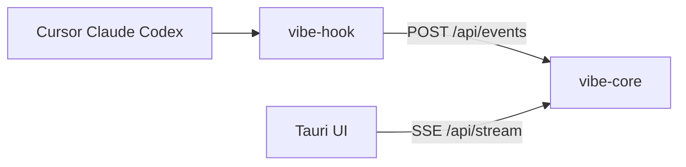

# Architecture

## Overview

Vibe Monitor uses a **single desktop process** that embeds `vibe-core` (Axum HTTP server on localhost) and a **Tauri + React** UI. External AI tools invoke the **`vibe-hook`** binary from user-level hook configs; the binary POSTs normalized events to `POST /api/events`.

## State machine

- Events map to phases: `active`, `idle` (30s timeout), `waiting_user`, `stopped`, `unknown`.
- Sessions keyed by `source:session_id`.
- Lite mode watches `~/.cursor/projects/**/agent-transcripts/**/*.jsonl` and `~/.claude/projects/**/*.jsonl`.

## Desktop presentation (HUD)

Persisted in `state.json` as `presentation`:

| Mode | Behavior |
|------|----------|
| `float` | Transparent always-on-top HUD window; default on macOS |
| `menubar` | Hide HUD; tray icon color reflects current phase |

macOS additionally:

- `visibleOnAllWorkspaces` on the main window so the float HUD follows all Spaces.
- `LSUIElement` + `ActivationPolicy::Accessory` so the app does not appear in the Dock.

Tray menu can switch presentation; `get_presentation` / `set_presentation` Tauri commands expose the same preference.

## Hook installation

`install::install_hooks` merges entries tagged `metadata.source = "vibe-monitor"` into:

- `~/.cursor/hooks.json`
- `~/.claude/settings.json` → `hooks`
- `~/.codex/hooks.json`
- Enables `[features] codex_hooks = true` in `~/.codex/config.toml` when missing

Windows installs `vibe-hook.cmd` wrapping `vibe-hook.exe`.

## API

| Method | Path |
|--------|------|
| GET | `/api/status` |
| GET | `/api/stream` (SSE) |
| POST | `/api/events` |
| POST | `/api/install-hooks` |
| GET | `/api/doctor` |

## Data directory

Resolved via `directories` crate as `ProjectDirs::from("com", "VibeMonitor", "vibe-monitor")` data dir:

- `bin/vibe-hook` — installed reporter
- `port` — current HTTP port
- `state.json` — reserved for future persistence
- `first-run.done` — wizard completion marker
